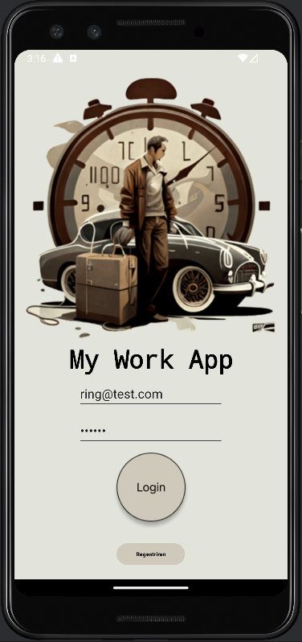
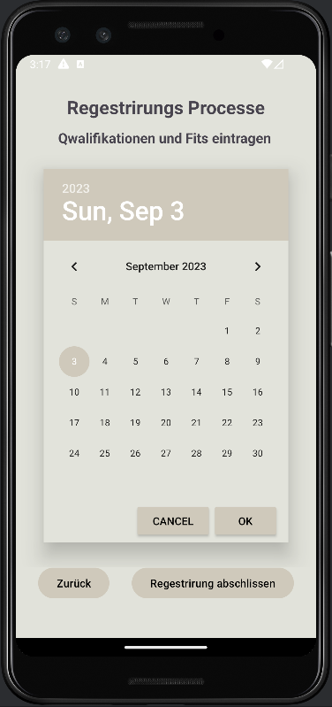
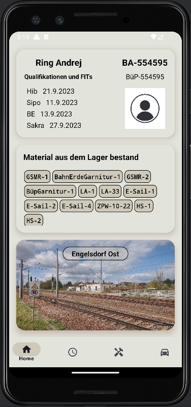
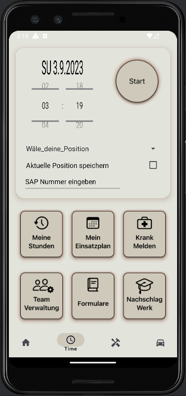
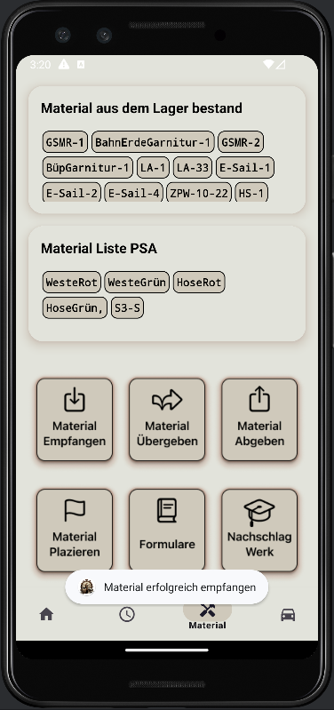
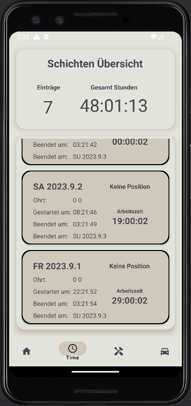
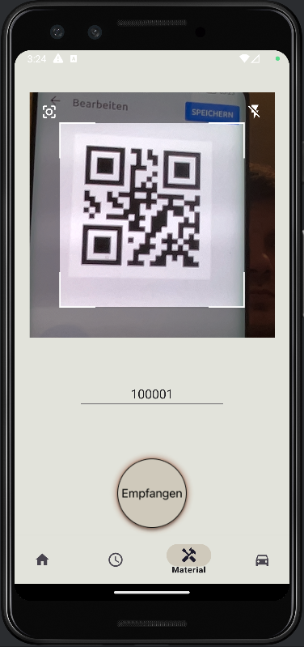

# Abschlussaufgabe App - README

Willkommen zur Dokumentation der Abschlussaufgabe App! Hier finden Sie detaillierte Informationen zu den einzelnen Codeabschnitten aus dem Paket `com.example.abschlussaufgabe`.

## Inhaltsverzeichnis

1. [Datenmodelle](#datenmodelle)
2. [Lokale Datenbank](#lokale-datenbank)
3. [API-Zugriff](#api-zugriff)
4. [Zusätzliche Features](#zusätzliche-features)

---

 

 

 

---

## Datenmodelle

Im Paket `data.model` werden verschiedene Datenmodelle definiert, die in der App verwendet werden. Diese Modelle repräsentieren wichtige Aspekte der App-Daten.

- `UserDataModel`: Ein Datenmodell, das Testbenutzerinformationen wie Name, Passwort, Qualifikationen und mehr enthält.
- `UserWorkTimeModel`: Ein Datenmodell, das die Arbeitszeit eines Benutzers mit Datum, Start- und Endzeit speichert.
- `StorageMaterialModel`: Ein Datenmodell, das Informationen über Materialien im Lager mit IDs und Standorten enthält.
- `RailStationsPhotoModel`: Ein Datenmodell, das den Titel und die Foto-URL eines Bahnhofsfotos speichert.

## Lokale Datenbank

Im Paket `data.local` wird der Code für die lokale Datenbank der App definiert. Hier werden die Datenmodelle mithilfe von Room gespeichert und abgerufen.

- `StorageMaterialDatabase`: Eine Room-Datenbank, die Materialinformationen speichert.
- `StorageMaterialDao`: Ein Data Access Object (DAO), das Datenbankzugriffe für Materialinformationen ermöglicht.

## API-Zugriff

Das Paket `data` enthält auch den Code für den Zugriff auf externe APIs.

- `ApiService`: Ein Interface, das die API-Endpunkte definiert, um Bahnhofsfotos abzurufen.
- `RailStationApi`: Ein Singleton-Objekt, das den API-Dienst mithilfe von Retrofit erstellt.

## Zusätzliche Features

Die App enthält auch einige zusätzliche Features, um die Benutzererfahrung zu verbessern:

- **`Hauptnavigation`**: Die App verwendet die `bottomNavBar`, um die Hauptnavigation durch verschiedene Fragmente zu ermöglichen.
- **`GPS-Standortverfolgung`**: ist eine Funktion in Android, mit der genauen geografischen Standort eines Geräts verfolg werden können. Im Kontext auf das Projekts  könnte die GPS-Ortungsverfolgung in verschiedenen Szenarien verwendet werden.
- **`QR-Code-Scanner`**: QR-Code-Scanner ermöglicht es Benutzern die Material-ID zu scannen, wenn Materialien empfangen,plziert oder abgegeben werden
- **`Kalender-Picker`**: Ermöglicht es den Benutzern, aus dem Kalender ein bestimmtes Datum auszuwählen.
- **`Time Picker`**: Ermöglicht es den Benutzern, eine genaue Uhrzeit auszuwählen
- **`AlertDialog`**: Die AlertDialog-Komponente wird in Android verwendet, um Pop-up-Dialoge anzuzeigen, die dem Benutzer zusätzliche Informationen, Warnungen, Bestätigungen oder Eingabemöglichkeiten bieten können
- **`API-Zugriff`**: Die App kann Bahnhofsfotos von einer externen API abrufen und anzeigen.
- **`Lokale Datenbank`**: Die App verwendet eine lokale Datenbank, um Materialinformationen und andere Daten zu speichern.
- **`Klick-Sounds`**: Die App spielt Klick-Sounds ab, wenn der Benutzer in der Hauptnavigation navigiert.
- **`RecyclerView`**: Ermöglicht dynamische Listen von Elementen anzuzeigen und bietet eine bessere Kontrolle über die Ansichtswiederverwendung
- **`Flexbox`**: Ermöglicht Elemente flexibel in Zeilen oder Spalten anzuordnen und ihre Größen dynamisch anzupassen, um den verfügbaren Platz optimal zu nutzen.

---

Dies ist eine detaillierte Übersicht über die Abschlussaufgabe App. Weitere technische Details finden Sie im entsprechenden Code.
